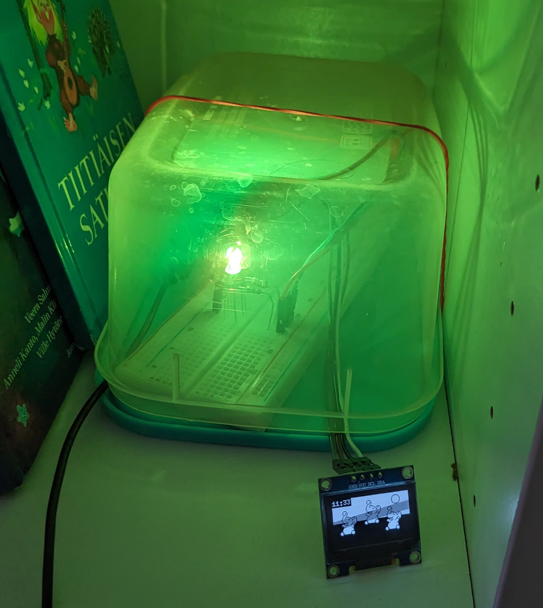
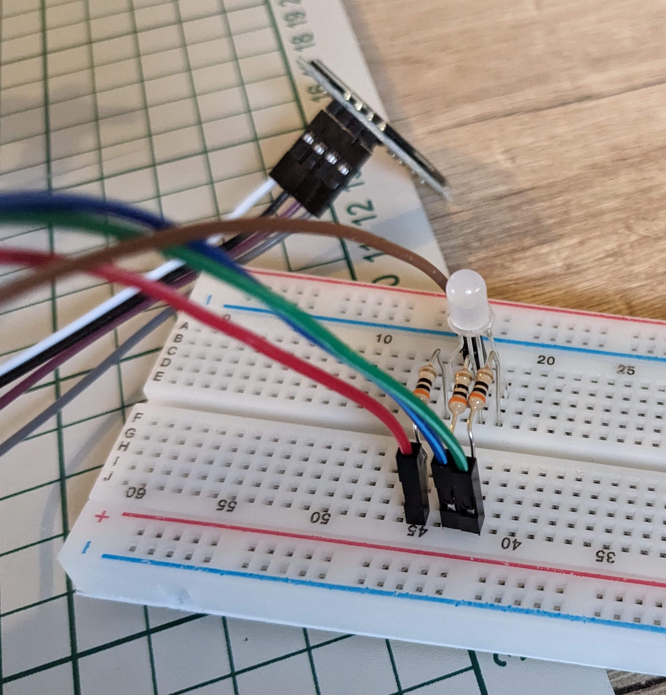
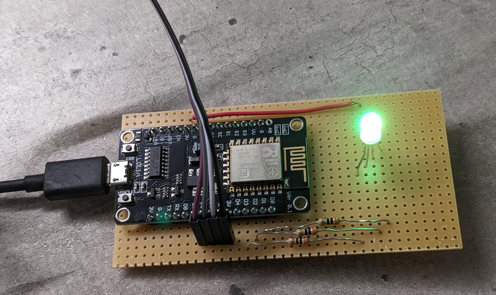

Children Wake Up Lamp
=====================

This simple electronics project helps children learn to fall back asleep at night, and wake up only at a given time. The light changes color at specific times, and the display shows different images. You can set up as many phases as you wish (such as sleep/calm activity/wake up), and different settings for each day of the week.

# Hardware

- NodeMCU board, ESP8266
- Monochrome 128x64 OLED Graphic Display, SSD1306, I2C
- RGB LED
- 3 resistors

- If your LED has a common anode, connect it to a power pin (3V3), if it has a common cathode, connect it to a ground pin (GND)
- The three other pins can go to any GPIO pin on the NodeMCU board (marked D1 to D12, D0 cannot be used), via the resistors
- Finding the correct value for the resistors depends on the exact LED you're using. You can also just test it with a high value first (like 1 kOhm) and reduce progressively until you get a high enough intensity

- Ground to ground, power to power. The SCL (clock) and SDA (data) pins can, again, go to any GPIO pin except D0

I recommend prototyping with breadboard, and then soldering permanently on stripboard.

# Software

Familiarise yourself with the [NodeMCU documentation](https://nodemcu.readthedocs.io/en/release/getting-started/)

These instructions are for MacOS, adapt as needed. The general steps are as follows:

1. Flash the board with the NodeMCU firmware: the provided firmware `nodemcu-release-14-modules-2023-11-10-09-00-51-float.bin` should work just fine and contain all the necessary modules
2. Copy or rename `config-example.lua` into `config.lua`, and modify it as needed. In particular, put your WiFi information, your time difference with UTC in hours, and the pins you used for the LED and display. See below for details on the rest of the config.
3. Upload the all the Lua files in the root of the repository to the board using NodeMCU-Tool. It should be as simple as `nodemcu-tool upload --port=/dev/ttyUSB0 *.lua`. You can find your device's port using `nodemcu-tool devices`

## Firmware

If you need to rebuild the firmware, you can use the [cloud builder](https://nodemcu-build.com/). The required modules (on top of the preselected ones) are:

- bit
- i2c
- PWM
- RTC time
- SNTP
- U8G2

In the U8G options, select `ssd1306_i2c_128x64_noname` in the "u8g2 display, I²C" menu

## Config

The `times` table is a array of seven entries, one per day of the week. It starts on 1 for Sunday, to 7 for Monday. You can have a separate entry for each day, or reuse common configs like in the example.

Each day's entry is an array that defines a time span with its starting time, the image to use, and the color in RGB (1 is full, 0 is off):

`{from = "07:00", image = images.waking, color = {1,0.5,0}}`

Each time span is assumed to end at the start of the next one, and the last one wraps around to the first one.

## Custom images

See instructions in `etc/XBMconverter.lua`. Make sure your image is the same size as the display.

## Common anode vs. common cathode

The code assumes a common anode, meaning that to turn on a color on the LED, you need to put the pin to ground to allow current through. With a common cathode, you need to power the LED by setting the pin high.

To switch, check file `clock.lua:13` and change which block is commented in function `set_led_immediate()`

# Using different components

- The code and wiring should be exactly the same when using a NodeMCU based on the more powerful ESP-32 chip.
- The built-in U8G2 module supports many kinds of displays out of the box, see [documentation](https://nodemcu.readthedocs.io/en/release/modules/u8g2/). If using another, remember to rebuild the firmware with the right option for the U8G module, and update the function call in `init_i2c_display()` in `clock.lua:47`
- If your display is a different size than 128x64, you will need to update the arguments to the call to `disp:drawXBM()`, in `clock.lua:96`, and provide different images
